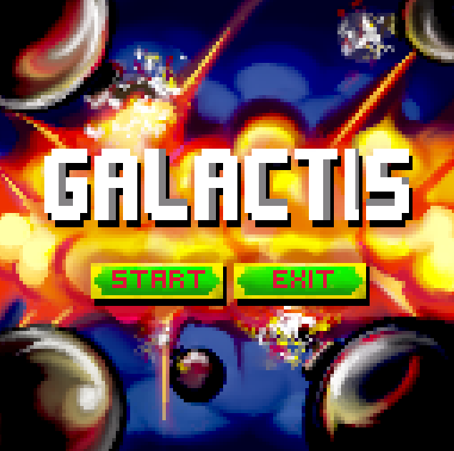
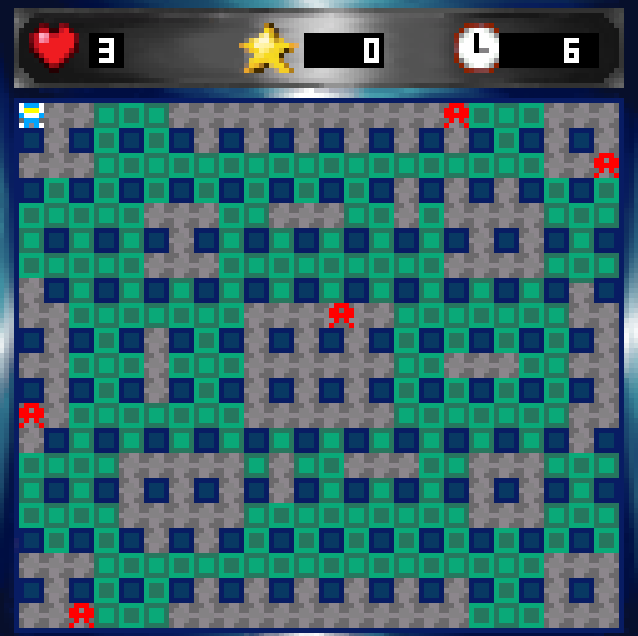

# Galactis

Galactis é um jogo estilo Bomberman desenvolvido em MIPS Assembly, utilizando Memory-Mapped I/O para teclado e display bitmap do simulador MARS 4.5.




> 📖 Para informações técnicas detalhadas sobre arquitetura e implementação, consulte o [README Técnico](README_TECHNICAL.md).

---

## Sumário

- [Pré-requisitos](#pré-requisitos)
- [Instalação](#instalação)
- [Como Jogar](#como-jogar)
- [Controles](#controles)
- [Objetivo do Jogo](#objetivo-do-jogo)

---

## Pré-requisitos

Antes de executar o jogo, você precisa ter instalado:

1. **Java Runtime Environment (JRE)** - versão 8 ou superior
   - Download: [java.com](https://www.java.com/pt-BR/download/)

2. **MARS 4.5** (MIPS Assembler and Runtime Simulator)
   - Download: [MARS - Missouri State University](http://courses.missouristate.edu/KenVollmar/MARS/download.htm)
   - Baixe o arquivo `Mars4_5.jar`

3. **(Opcional) VSCode** com a extensão **Better MIPS Support** para edição de código

---

## Instalação

### Passo 1: Baixar o projeto

Faça o download ou clone este repositório:

```bash
git clone https://github.com/FelipeEstevanatto/Galactis.git
cd Galactis
```

### Passo 2: Abrir o MARS

1. Execute o MARS (duplo clique no arquivo `Mars4_5.jar`)
2. Abra o arquivo `main.asm` do projeto (File > Open)

### Passo 3: Configurar o MARS

1. Vá em **Settings > Assemble all files in directory** (marque esta opção)
2. Configure o **Run Speed** como **"Maximum"** (no interaction)
3. Caso o jogo este lento na sua máquina, altere os valores de `# Game timing` no arquivo de configuração `engine/config.asm`

### Passo 4: Configurar as ferramentas MMIO

Você precisa abrir duas ferramentas do menu **Tools**:

#### 4.1 Keyboard and Display MMIO Simulator
- Vá em **Tools > Keyboard and Display MMIO Simulator**
- Conecte ao MIPS clicando em **Connect to MIPS** e selecione o `Delay Length` como `1`
- Mantenha a janela aberta

#### 4.2 Bitmap Display
- Vá em **Tools > Bitmap Display**
- Configure com os seguintes valores:
  - **Unit Width in Pixels:** `4`
  - **Unit Height in Pixels:** `4`
  - **Display Width in Pixels:** `512`
  - **Display Height in Pixels:** `512`
  - **Base address for display:** `0x10000000 (global data)`
- Clique em **Connect to MIPS**
- Redimensione a janela para visualizar completamente a tela 512x512

---

## Como Jogar

### Passo 1: Compilar o código
- Clique no botão **Assemble** (ícone de chave de fenda e martelo) ou pressione `F3`

### Passo 2: Executar o jogo
- Clique no botão **Run** (ícone de play) ou pressione `F5`

### Passo 3: Interagir com o jogo
- **IMPORTANTE:** Clique na janela **Keyboard and Display MMIO Simulator**
- Digite os comandos de teclado **nesta janela** (não na janela principal do MARS)

---

## Controles

| Tecla | Ação |
|-------|------|
| `W` | Mover para cima |
| `A` | Mover para esquerda |
| `S` | Mover para baixo |
| `D` | Mover para direita |
| `Espaço` | Colocar bomba |
| `P` | Pausar / Retomar jogo |
| `Enter` | Iniciar jogo / Reiniciar após game over |
| `E` | Sair do jogo |

---

## Objetivo do Jogo

- **Navegue** pelo labirinto usando as teclas WASD
- **Coloque bombas** para destruir blocos quebráveis e inimigos
- **Evite** ser atingido pelas explosões das suas próprias bombas
- **Evite** os inimigos que se movem pelo mapa
- **Encontre a porta de saída** escondida sob um bloco quebrável
- **Alcance a porta** para vencer o jogo!

### Dicas
- Você começa com 3 vidas
- As bombas explodem após 3 segundos em formato de cruz
- A explosão para quando atinge uma parede sólida
- A porta só aparece quando você destrói o bloco que a cobre
- Seu score aumenta quando você elimina inimigos

---

## Ferramentas Auxiliares

### Gerar sprites a partir de imagens

Se você quiser modificar os sprites do jogo, pode usar o script Python incluído:

**No Windows (PowerShell):**
```powershell
powershell -ExecutionPolicy Bypass -File tools/generate_all.ps1
```

**Pré-requisitos para sprites:**
- Python 3.x
- Biblioteca Pillow (`pip install Pillow`)

---

## Problemas Comuns

### O jogo não aparece na tela
- Verifique se o **Bitmap Display** está conectado ao MIPS
- Verifique se o **Base address** está configurado como `0x10000000`

### Os controles não funcionam
- Certifique-se de clicar na janela **Keyboard and Display MMIO Simulator** antes de digitar

### Erro ao compilar
- Verifique se a opção **"Assemble all files in directory"** está marcada e o arquivo aberto é `main.asm`

---

## Licença

Este projeto foi desenvolvido para fins educacionais.
